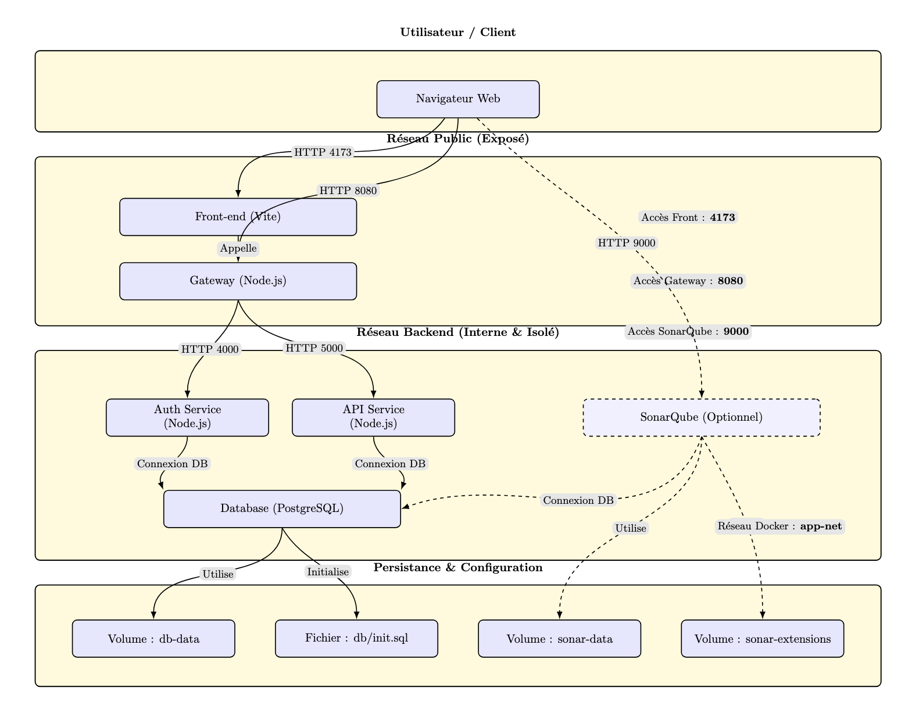

# DM Conteneurisation — SecureDesk (Docker Compose)


## Prérequis
- Docker Engine (récent)
- Docker Compose v2 (`docker compose ...`)
- OS : Windows / macOS / Linux

### Ports utilisés (hôte)
- **Front** : `http://localhost:4173`
- **Gateway (entrée backend)** : `http://localhost:8080`
- **SonarQube (optionnel)** : `http://localhost:9000` (profil `security`)

> La base PostgreSQL n’est **pas exposée** à l’hôte : elle est accessible uniquement en interne via le réseau Docker.

---

## Etapes completes pour lancer le projet
1) Recuperer le projet :
```bash
git clone <url-du-repo>
cd <dossier-du-repo>
```

2) Creer le fichier d'environnement :
```bash
cp .env.example .env
```
Puis modifier `.env` et definir au minimum :
- `POSTGRES_PASSWORD`
- `JWT_ACCESS_SECRET`
- `JWT_REFRESH_SECRET`

3) Lancer la stack :
```bash
docker compose up --build
```

4) Acceder a l'application :
- Front : http://localhost:4173
- Gateway : http://localhost:8080

5) Creer un compte utilisateur :
- Aller sur http://localhost:4173/register
- S'inscrire avec un email et un mot de passe

6) Promouvoir un compte en ADMIN (optionnel) :
```bash
docker compose exec db psql -U securedesk -d securedesk -c "UPDATE users SET role='ADMIN' WHERE email='vous@example.com';"
```

7) Verifier que tout fonctionne :
```bash
curl http://localhost:8080/health
```

---

## Procédure de build et lancement

### Lancement normal (stack principal)
```bash
docker compose up --build
```

Accès :
- Front : http://localhost:4173
- Gateway : http://localhost:8080

Arrêt :
```bash
docker compose down
```

Logs :
```bash
docker compose logs -f
```

Reset complet (supprime les données persistées) :
```bash
docker compose down -v
```

### Lancement optionnel : SonarQube (profil security)
Le service SonarQube est derrière un profil Compose, donc il n’est pas lancé par défaut.

```bash
docker compose --profile security up --build
```

Accès SonarQube :
- http://localhost:9000

---

## Variables d’environnement (.env)
Le `docker-compose.yml` attend des variables d’environnement (via `.env`).

### 1) Créer votre `.env`
À la racine du dépôt :
```bash
cp .env.example .env
```

### 2) Variables importantes
Obligatoires / très recommandées :

- `POSTGRES_PASSWORD`
- `JWT_ACCESS_SECRET`
- `JWT_REFRESH_SECRET`

Exemple minimal (à adapter) :
```env
POSTGRES_USER=securedesk
POSTGRES_PASSWORD=change_me
POSTGRES_DB=securedesk

AUTH_PORT=4000
API_PORT=5000
GATEWAY_PORT=8080

JWT_ACCESS_SECRET=change_me_access
JWT_REFRESH_SECRET=change_me_refresh

FRONTEND_ORIGIN=http://localhost:4173
VITE_API_BASE=http://localhost:8080

SECURE_COOKIES=false
COOKIE_DOMAIN=localhost
```

Bonnes pratiques : `.env` ne doit pas être commit. Fournir `.env.example` sans secrets.

---

## Schema Architecture 



---

## Architecture Docker Compose (services)
Services définis dans `docker-compose.yml` :

- `db` : PostgreSQL 15 (persistance `db-data` + init SQL)
- `auth-service` : microservice d’authentification (Node) — interne
- `api-service` : microservice API métier (Node) — interne
- `gateway` : point d’entrée HTTP backend (Node) — **exposé sur 8080**
- `front` : front Vite — **exposé sur 4173**
- `sonarqube` : optionnel, profil `security` — **exposé sur 9000**

Réseau :
- `app-net` (bridge) : réseau commun à tous les services

Volumes :
- `db-data` : données PostgreSQL (persistance)
- `sonar-data`, `sonar-extensions` : données/extensions SonarQube (optionnel)

---

## Détails par service (ports, env, volumes, dépendances)

### db (PostgreSQL 15)
- Image : `postgres:15`
- Environnement :
  - `POSTGRES_USER` (défaut : securedesk)
  - `POSTGRES_PASSWORD` (obligatoire)
  - `POSTGRES_DB` (défaut : securedesk)
- Volumes :
  - `db-data:/var/lib/postgresql/data` (persistance)
  - `./db/init.sql:/docker-entrypoint-initdb.d/init.sql:ro` (initialisation)
- Healthcheck :
  - `pg_isready -U <user>`
- Réseau :
  - `app-net`

### auth-service
- Build : `./auth-service`
- Dépend de `db` (attend `service_healthy`)
- Environnement :
  - `DATABASE_URL=postgres://...@db:5432/...`
  - `AUTH_PORT` (défaut : 4000)
  - `JWT_ACCESS_SECRET`, `JWT_REFRESH_SECRET`
  - paramètres (cookies, lock, CORS) : `FRONTEND_ORIGIN`, `COOKIE_DOMAIN`, `SECURE_COOKIES`, etc.
- Healthcheck :
  - `GET http://localhost:<AUTH_PORT>/health` (dans le conteneur)
- Réseau :
  - `app-net`
- Exposition hôte :
  - aucune (service interne)

### api-service
- Build : `./api-service`
- Dépend de `db` (attend `service_healthy`)
- Environnement :
  - `DATABASE_URL=postgres://...@db:5432/...`
  - `API_PORT` (défaut : 5000)
  - `JWT_ACCESS_SECRET`
  - `FRONTEND_ORIGIN` (CORS)
- Healthcheck :
  - `GET http://localhost:<API_PORT>/health` (dans le conteneur)
- Réseau :
  - `app-net`
- Exposition hôte :
  - aucune (service interne)

### gateway
- Build : `./gateway`
- Dépend de `auth-service` et `api-service` (attend `service_healthy`)
- Exposé sur l’hôte :
  - `${GATEWAY_PORT:-8080}:${GATEWAY_PORT:-8080}`
- Environnement :
  - `GATEWAY_PORT` (défaut : 8080)
  - `AUTH_SERVICE_URL` (défaut : http://auth-service:4000)
  - `API_SERVICE_URL` (défaut : http://api-service:5000)
  - CORS : `FRONTEND_ORIGIN`
  - rate limiting : `RATE_LIMIT_WINDOW_MS`, `RATE_LIMIT_MAX`, `DISABLE_RATE_LIMIT`
- Healthcheck :
  - `GET http://localhost:<GATEWAY_PORT>/health` (dans le conteneur)
- Réseau :
  - `app-net`

### front
- Build : `./front`
- Dépend de `gateway` (attend `service_healthy`)
- Exposé sur l’hôte :
  - `4173:4173`
- Environnement :
  - `VITE_API_BASE` (défaut : http://localhost:8080)
- Réseau :
  - `app-net`

### sonarqube (optionnel)
- Image : `sonarqube:lts-community`
- Profil : `security`
- Exposé sur l’hôte :
  - `9000:9000`
- Dépend de `db` (attend `service_healthy`)
- Environnement (connexion DB) :
  - `SONAR_JDBC_URL=jdbc:postgresql://db:5432/<db>`
  - `SONAR_JDBC_USERNAME=<user>`
  - `SONAR_JDBC_PASSWORD=<password>`
- Volumes :
  - `sonar-data:/opt/sonarqube/data`
  - `sonar-extensions:/opt/sonarqube/extensions`
- Réseau :
  - `app-net`

---

## Persistance des données
PostgreSQL persiste via le volume `db-data`.

SonarQube (optionnel) persiste via `sonar-data` et `sonar-extensions`.

Test simple :
1. `docker compose up`
2. Ajouter des données via l’app
3. `docker compose down`
4. `docker compose up`

Les donnees restent (`docker compose down -v` supprime la persistance).

---

## Communication inter-services (réseau + DNS Compose)
Les services communiquent via le réseau `app-net` :
- `auth-service` -> `db:5432`
- `api-service` -> `db:5432`
- `gateway` -> `http://auth-service:4000` et `http://api-service:5000`
- `front` -> `http://localhost:8080` (gateway exposé)

---

## Sécurité / Bonnes pratiques (attendu DM)
- DB non exposée à l’hôte (réduction surface d’attaque)
- Secrets via `.env` non versionné + `.env.example`
- Healthchecks + `depends_on: service_healthy` pour démarrage fiable
- Services séparés (1 conteneur = 1 responsabilité)
- SonarQube isolé derrière un profil (`--profile security`)

---

## Dépannage

### Ports déjà utilisés
Changer les ports dans `.env` (ex : `GATEWAY_PORT=8081`), puis :
```bash
docker compose up --build
```

### Vérifier l’état
```bash
docker compose ps
```

### Logs
```bash
docker compose logs -f
```
